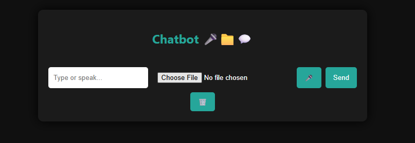
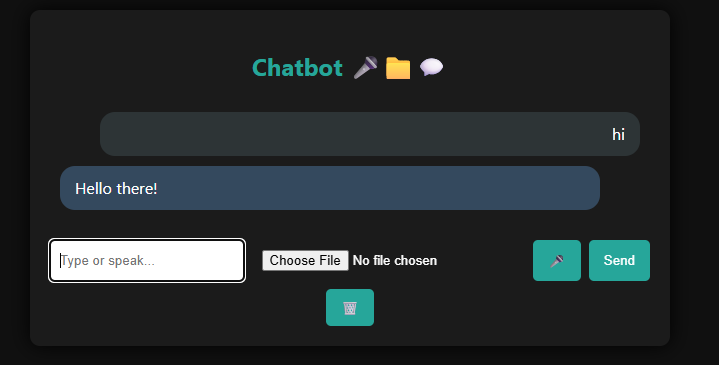
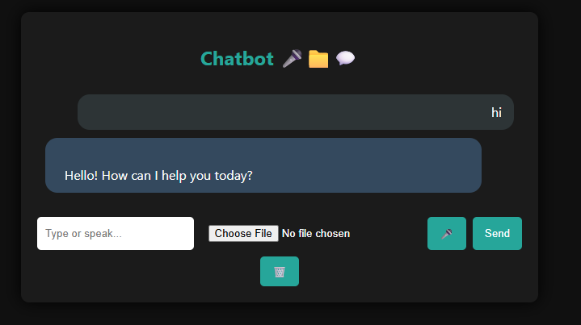
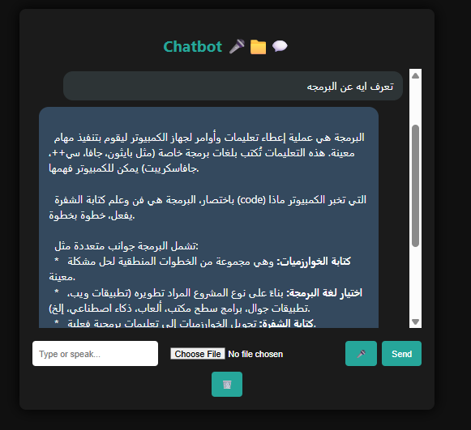

# 💬 Chatbot Agent

A powerful local chatbot powered by Google's Gemini API with voice, file upload, and smart memory compression.



## 🚀 Features

- 🎤 **Speech to Text** – Input via microphone
- 🔊 **Text to Speech** – Bot speaks back responses
- 📁 **File Upload Support** – Upload PDF files and extract actual content
- 🧠 **Chat Compression** – Preserve context in a light format
- 🧹 **Clear Chat** – One click to reset conversation
- 💬 **Stylish UI** – Responsive, dark-themed interface with emoji icons

---

## 🛠️ Installation

```bash
git clone https://github.com/YOUR_USERNAME/chatbot-agent.git
cd chatbot-agent
pip install -r requirements.txt
python app.py
```

---

## 🌐 Usage

- Open [http://localhost:5000](http://localhost:5000)
- Speak, type, or upload a file and chat with your assistant

---

## 📂 File Structure

- `app.py` – Main Flask backend
- `utils/chat_compression.py` – Chat memory logic
- `templates/index.html` – UI structure
- `static/style.css` – Chatbot styling

---

## 📸 Screenshots

| Voice & Text | File Upload | Arabic Answer |
|--------------|-------------|----------------|
|  |  |  |

---

## 🧠 Powered by

- [Gemini API](https://ai.google.dev/)
- Flask
- JavaScript (Vanilla)
- HTML5 / CSS3

---

## 👨‍💻 Author

Developed with ❤️ by Mahmoud Elnahrawy

